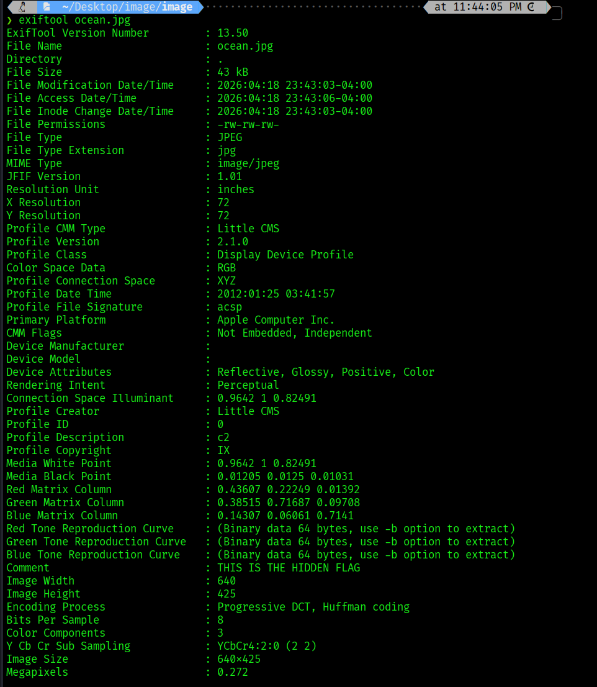
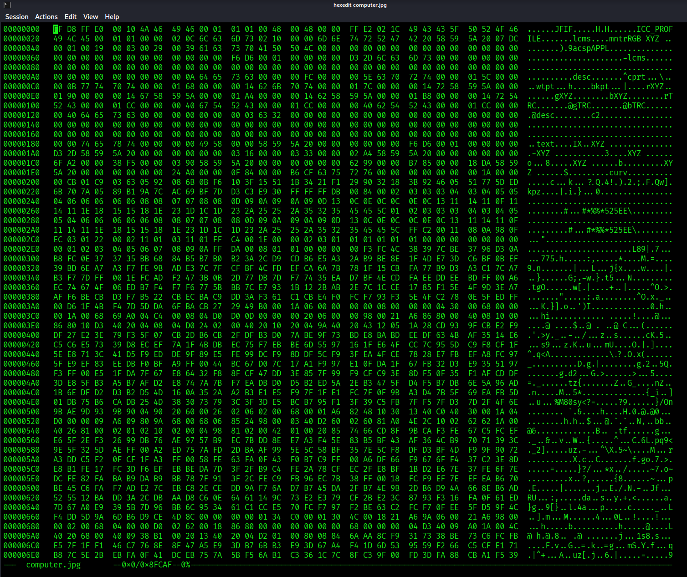
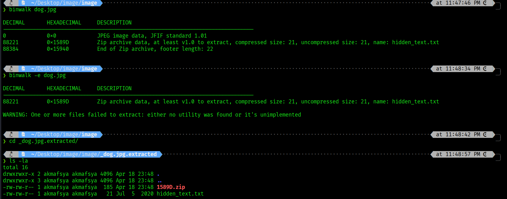
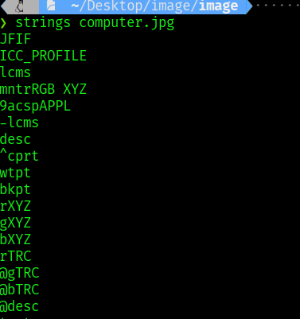
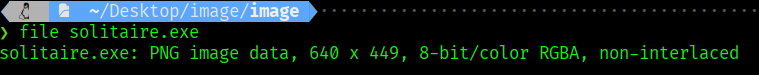
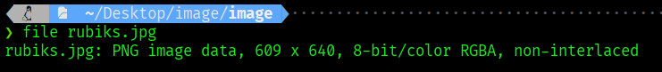

# Week 4: METADATA

## Tools learned
1. `file`
2. `strings`
3. `exiftool`
4. `hexeditor`
5. `binwalk`

## Task

| Picture | Tools | Command | POC | Analysis |
|---|---|---|---|---|
| `Ocean.jpg` | `exiftool` | `exiftool ocean.jpg` |  | The metadata in Kali reveals the hidden flag in the comment field. |
| `Computer.jpg` | `hexeditor` | `hexeditor computer.jpg` |  | This tool allows direct inspection of the file header and raw bytes. |
| `dog.jpg` | `binwalk` | `binwalk dog.jpg` `binwalk -e dog.jpg` `cd _dog.jpg.extracted/` |  | Used to detect and extract hidden files from inside another file. |
| `computer.jpg` | `strings` | `strings computer.jpg` |  | Used to extract readable text from a file and identify possible hidden information. |
| `solitaire.exe` | `file` | `file solitaire.exe` |  | The result shows that the file is actually a PNG image. |
| `rubiks.jpg` | `file` | `file rubiks.jpg` |  | The result shows that the file is also actually a PNG image. |